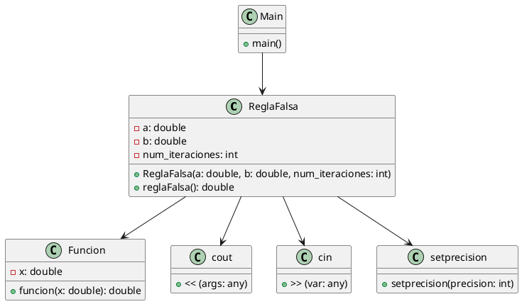

# Manual de Desarrollador

## Arquitectura (PUML)

La arquitectura del programa se representa en el siguiente diagrama PlantUML:

## Instrucciones de Compilación

Para compilar el programa que utiliza el método de la regla falsa, sigue los siguientes pasos:

1. Abre un entorno de desarrollo C++ compatible, como Visual Studio Code con el complemento C++ o Code::Blocks.
2. Crea un nuevo proyecto o abre un proyecto existente.
3. Agrega los archivos de código fuente necesarios al proyecto, incluyendo el archivo que contiene la función `funcion` y la función `reglaFalsa`.
4. Configura la configuración de compilación según las preferencias del entorno de desarrollo.
5. Compila el proyecto utilizando la opción de compilación correspondiente en el entorno de desarrollo.
6. Si no hay errores de compilación, se generará un archivo ejecutable.
7. Ejecuta el archivo ejecutable generado para utilizar el programa.
8. Sigue las instrucciones en la interfaz de línea de comandos para ingresar los valores de `a`, `b` y el número de iteraciones.
9. El programa calculará la raíz aproximada utilizando el método de la regla falsa y mostrará el resultado en la salida.

## Errores Conocidos

- El programa puede generar resultados incorrectos si la función no cumple con las condiciones necesarias para aplicar el método de la regla falsa, como la existencia de una raíz en el intervalo dado.
- El programa puede entrar en un bucle infinito si no se alcanza la convergencia dentro del número máximo de iteraciones especificado.
- El programa puede generar resultados aproximados debido a la naturaleza iterativa del método de la regla falsa.

Se recomienda revisar los resultados obtenidos y verificar si cumplen con las expectativas esperadas. En caso de encontrar errores o comportamientos inesperados, se sugiere verificar la implementación de la función `funcion` y los parámetros proporcionados al método de la regla falsa.